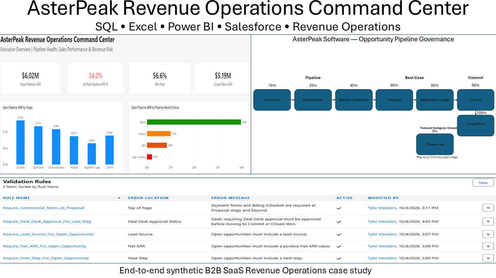

# AsterPeak Revenue Operations Command Center



## Overview

AsterPeak Software is a fictional U.S.-based B2B SaaS company with approximately $15–20M in ARR and roughly 100 employees.

I built this project around a synthetic CRM dataset containing **13,864 records** to work through a realistic Revenue Operations environment from end to end. The project covers:

- CRM data quality and governance
- Lead routing and Marketing-to-Sales handoff
- Pipeline health and forecasting
- Deal Desk and commercial approvals
- SQL analysis and reconciliation
- Excel audit workflows
- Power BI executive reporting
- Salesforce configuration and controls
- Process design and SOPs
- Executive recommendations

I used the following framework throughout the project:

**Business Rule → Data → Analysis → Finding → Recommendation → Governance Control**

---

## Start Here

For the fastest overview of the project:

- [Executive Presentation](09_Final_Case_Study/AsterPeak_Revenue_Operations_Executive_Presentation.pdf)
- [Full Case Study](09_Final_Case_Study/AsterPeak_Revenue_Operations_Case_Study.pdf)
- [Executive Recommendations](09_Final_Case_Study/AsterPeak_Executive_Recommendations.pdf)

Additional working files, analysis, dashboards, process documentation, and portfolio assets are organized throughout the repository.

---

## Business Problem

AsterPeak's modeled revenue organization includes Marketing, Marketing Operations, SDRs, Account Executives, Sales Leadership, Revenue Operations, Finance, and Legal.

The analysis surfaced several common RevOps challenges:

- Incomplete or inconsistent CRM ownership, segmentation, and territory data
- Lead-routing exceptions across segment and geography
- Stale and overdue opportunities within active pipeline
- Missing opportunity data affecting pipeline reliability
- Forecast-category exceptions
- Inconsistent historical Deal Desk approval evidence
- Revenue processes that lacked fully documented operating procedures

The project focused on both reporting and the controls behind the data. I wanted to identify where the revenue process was breaking, quantify the impact, and then build practical ways to prevent or surface those issues earlier.

---

## Key Findings

| Area | Finding |
|---|---|
| Open Pipeline | **$6.02M ARR** across 160 open opportunities |
| Pipeline Risk | **53 opportunities / $2.05M ARR at risk** |
| At-Risk Pipeline | **34%** of total open pipeline ARR |
| Lead Routing | **87.5%** compatible with expected routing logic |
| Forecast Alignment | **95.7%** aligned across 885 forecast snapshots |
| Forecast Exceptions | **38** misaligned snapshots |
| Deal Desk Review Population | **150** closed opportunities met review criteria |
| Approval Evidence | **61 of 150 / 40.7%** had identifiable approval evidence |
| Deal Desk Flag Accuracy | **97.6%** |
| Open Opportunity Completeness | **30 of 160** had at least one critical data gap |

Additional account analysis identified:

- 10 accounts with incorrect stored territories
- 4 accounts with missing stored territories
- 4 accounts with missing state data preventing territory validation
- 9 accounts with misassigned owners
- 6 unassigned accounts

---

## Solution

I used the findings to define controls and processes across CRM governance, pipeline management, forecasting, lead routing, and Deal Desk.

### CRM Governance

Salesforce controls were implemented to enforce critical opportunity standards including:

- Positive Net ARR
- Required Next Step
- Required Lead Source
- Payment Terms and Billing Schedule beginning at Proposal
- Deal Desk approval before qualifying opportunities can advance to Commit or Closed Won

Account segmentation logic was also modeled using employee-count thresholds.

### Pipeline & Forecast Governance

The project established:

- Defined opportunity stages and probabilities
- Stage-aligned forecast categories
- Stale opportunity monitoring
- Overdue close-date monitoring
- CRM completeness checks
- Forecast-alignment auditing
- Recurring pipeline-review expectations

### Marketing-to-Sales Handoff

The operating model formalized:

- Lead → MQL → SQL → Opportunity → Customer lifecycle progression
- Segment and territory routing
- SDR assignment
- Four-business-hour initial MQL follow-up target
- HubSpot ownership of early marketing lifecycle activity
- Salesforce ownership after sales conversion

### Deal Desk Governance

Commercial-review triggers include:

- Discount greater than 10%
- Net ARR of at least $100,000
- Nonstandard payment terms
- Nonstandard billing schedules
- Custom pricing
- Nonstandard contract terms
- Implementation discount greater than 20%
- Customers outside defined target-size boundaries
- Other material commercial risks requiring manual review

Approval routing incorporates Sales Leadership, Revenue Operations, Finance, and Legal as required.

---

## Technology & Tools

### SQL / PostgreSQL

Used for:

- Relational joins
- Data-quality analysis
- Segmentation logic
- Territory and ownership audits
- Pipeline analysis
- Forecast analysis
- Deal Desk analysis
- CRM completeness checks
- Reconciliation

Key file:

[AsterPeak SQL Analysis Portfolio](04_SQL/AsterPeak_SQL_Analysis_Portfolio.sql)

### Microsoft Excel

A record-level audit and reconciliation workbook was created with dedicated views for:

- Audit Summary
- Account Audit
- Lead Routing
- Pipeline Audit
- Deal Desk Audit
- Pivot Analysis
- Reconciliation

Key file:

[AsterPeak RevOps Audit Workbook](05_Excel/AsterPeak_RevOps_Audit_Workbook.xlsx)

### Power BI

A six-page Revenue Operations dashboard was developed:

1. Executive Overview
2. Pipeline Health
3. Sales Performance
4. Lead Funnel & Source
5. Forecast Reliability
6. CRM & Deal Desk Governance

The dashboard combines executive KPIs with diagnostic views for revenue and operational risk.

Power BI screenshots are available in:

[`10_Portfolio_Assets/Power_BI`](10_Portfolio_Assets/Power_BI)

### Salesforce

A Salesforce Trailhead Playground was used to demonstrate active CRM governance through:

- Custom Opportunity fields
- Formula logic
- Validation rules
- Opportunity-stage configuration
- Forecast categories
- Deal Desk controls
- Reports
- Governance dashboard

Salesforce evidence is available in:

[`07_Salesforce/Screenshots`](07_Salesforce/Screenshots)

and

[`10_Portfolio_Assets/Salesforce`](10_Portfolio_Assets/Salesforce)

### Process Design

Three major workflows were documented:

- Marketing-to-Sales Lead Handoff
- Opportunity Pipeline Governance
- Deal Desk Approval Workflow

Each workflow includes supporting design documentation and process maps.

Portfolio-ready exports are available in:

[`10_Portfolio_Assets/Process_Maps`](10_Portfolio_Assets/Process_Maps)

---

## Repository Structure

```text
AsterPeak_Revenue_Operations_Command_Center/
│
├── 01_Project_Brief/
│   ├── Data Dictionary
│   ├── Operating Model
│   └── Project Charter
│
├── 02_Raw_Data/
│   ├── Synthetic CRM Dataset
│   └── PostgreSQL Import Bundle
│
├── 03_Clean_Data/
│   └── Transformation / clean-data documentation
│
├── 04_SQL/
│   ├── Data Load Script
│   └── SQL Analysis Portfolio
│
├── 05_Excel/
│   └── RevOps Audit & Reconciliation Workbook
│
├── 06_Power_BI/
│   └── Revenue Operations Dashboard
│
├── 07_Salesforce/
│   └── Implementation Screenshots
│
├── 08_Process_Maps/
│   ├── Lead Lifecycle & Handoff
│   ├── Opportunity Pipeline Governance
│   ├── Deal Desk Approval Workflow
│   └── SOPs
│
├── 09_Final_Case_Study/
│   ├── Full Case Study
│   ├── Executive Recommendations
│   └── Executive Presentation
│
└── 10_Portfolio_Assets/
    ├── Power BI
    ├── Salesforce
    ├── Process Maps
    └── Project Hero
```

---

## What This Project Demonstrates

### Technical & Analytical

- SQL
- Relational data analysis
- CASE logic
- Data-quality auditing
- Reconciliation
- Excel
- PivotTables
- Power BI
- DAX measures
- KPI development
- Funnel analysis
- Pipeline analysis
- Forecast analysis
- Exception reporting

### CRM & Systems

- Salesforce configuration
- Custom fields
- Formula fields
- Validation rules
- Opportunity stages
- Forecast categories
- Salesforce reports and dashboards
- CRM governance
- Lead routing
- Lifecycle management
- HubSpot / Salesforce operating-model design

### Revenue Operations

- Pipeline governance
- Forecast governance
- CRM data governance
- Marketing-to-Sales handoff
- Deal Desk design
- Commercial approval logic
- Segmentation
- Territory alignment
- Process mapping
- SOP development
- Executive recommendations

### Business Communication

- Translating analytical findings into operational recommendations
- Designing management reporting
- Documenting business processes
- Presenting technical work in business terms
- Connecting analytics to operational controls

---

## Project Outcome

The project brings together analysis, reporting, CRM governance, and process design in one RevOps case study.

The goal was not just to identify issues in dashboards. It was to show how the findings could be turned into controls, workflows, and operating processes that help keep revenue data more reliable over time.

---

## Important Notes

AsterPeak Software is a fictional company and all underlying CRM records are synthetic.

The Salesforce implementation was completed in a Trailhead Playground and represents a functional demonstration of governance logic rather than a production deployment.

HubSpot is incorporated into the operating model and lifecycle design conceptually; this project does not include a live HubSpot-to-Salesforce integration.

Missing historical Deal Desk approval evidence does not prove that approval never occurred. It indicates that identifiable approval evidence was not available in the modeled CRM data.

Business-impact statements represent expected operational value rather than realized production outcomes.

The analysis date was fixed at **September 28, 2026** to keep stale and overdue opportunity calculations reproducible.
